# Personal Finance Tracker
> A production-ready, intelligent personal finance backend built with Node.js, Express.js, PostgreSQL, Redis, Bull, and powered by multimodal AI via Groq (Meta Llama-3).

    

This is not just a CRUD application. It is a full financial intelligence platform that tracks income, expenses, and investments while running a 3-method statistical anomaly detection engine, a 7-feature AI layer, a Redis-backed async notification system, and a paginated AI recommendations feed — all built in 5 days as a backend engineering assignment.

---

## Table of Contents
1. [System Architecture](#1-system-architecture)
2. [Database Design (ER Diagram)](#2-database-design-er-diagram)
3. [Authentication Flow](#3-authentication-flow)
4. [Part A — Core Features](#4-part-a--core-features-rubric-mapped)
5. [Part B — Extra Credit Features](#5-part-b--extra-credit)
6. [API Reference & Testing Screenshots](#6-api-reference--testing-screenshots)
7. [Tech Stack](#7-tech-stack)
8. [Local Setup](#8-local-setup)
9. [Deployment](#9-deployment)
10. [Known Limitations & Future Roadmap](#10-known-limitations--future-roadmap)

---

## 1. System Architecture

The monolithic backend strictly adheres to a Model-View-Controller (MVC) architecture, specifically utilizing the Controller-Service-Repository pattern. This separation of concerns ensures that routing, business logic, and database interactions are isolated, maximizing testability and preventing tightly coupled spaghetti code.

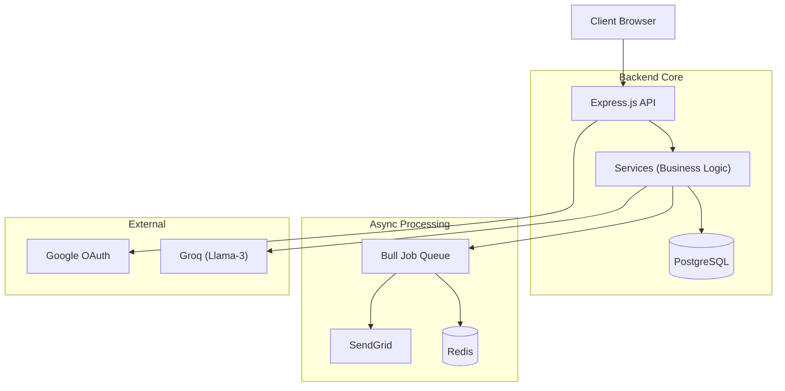

Every layer has a single responsibility. Controllers never touch the database. Repositories never contain business logic. Services never directly send HTTP responses. This makes every component independently testable and replaceable.

---

## 2. Database Design (ER Diagram)

The schema is fully normalized to 3NF. Financial amounts use NUMERIC(12,2) throughout — never FLOAT — to prevent floating point errors in monetary calculations.

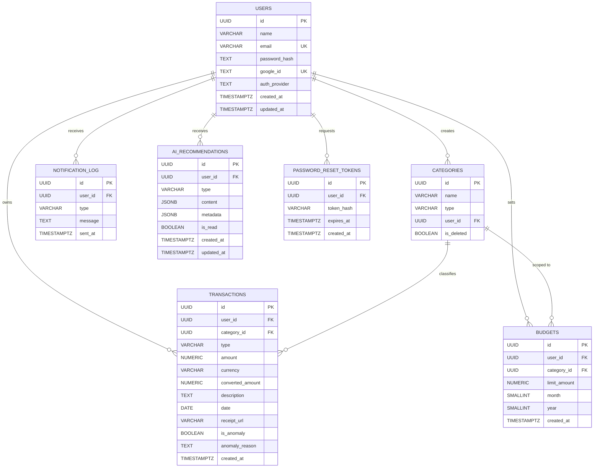

| Decision | Implementation | Why |
|---|---|---|
| Decimal precision | NUMERIC(12,2) | Prevents float rounding in financial math |
| Soft deletes | is_deleted on categories | Preserves transaction history for FK integrity |
| Currency normalization | converted_amount in INR | Enables cross-currency SQL aggregations |
| Anomaly storage | is_anomaly + anomaly_reason on transactions | No separate table needed, instant join |
| AI recommendations | Separate table with JSONB content + metadata | Flexible schema per recommendation type |
| Notification log | Separate table with type + sent_at | Deduplication checks and audit trail |
| Budget uniqueness | UNIQUE(user_id, category_id, month, year) | Prevents duplicate budgets per category per month |

---

## 3. Authentication Flow

The system supports two parallel authentication strategies — standard email/password with JWT and Google OAuth 2.0 — unified into a single user identity.

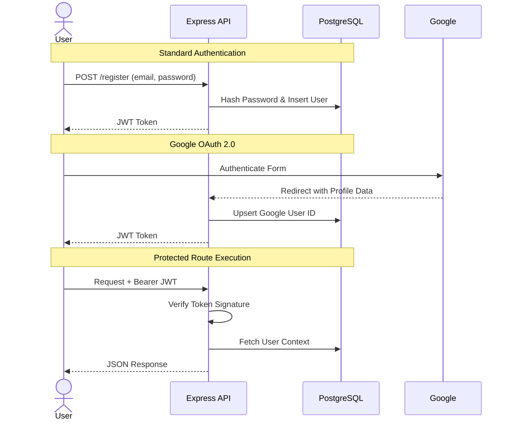

| Scenario | Handling |
|---|---|
| Duplicate email registration | 409 Conflict with clear message |
| Google account + existing email | Merges to same user record |
| Expired JWT | 401 with "Token expired" message |
| Missing token | 401 with "No token provided" |
| Tampered token | 401 with "Invalid token" |

---

## 4. Part A — Core Features (Rubric Mapped)

### 4.1 User Authentication & Profile Management
**Rubric mapping:** functionality, logic, code efficiency

A robust identity layer managing secure user registrations, credential validations, and profile state.
**Implementation approach:**
Utilizes the `UserRepository` to isolate raw SQL bindings, parsing business logic within `AuthService`. Cryptography is strictly managed server-side using bcrypt and synchronous JWT signing.

**Edge cases handled:**
- Duplicate email returns 409 not 500
- Password hashed with bcrypt cost factor 12
- JWT expiry handled with clear error message
- Google OAuth merges with existing email account
- Profile updates validate fields independently

**API endpoints:**
| Method | Endpoint | Auth | Description |
|---|---|---|---|
| POST | /api/auth/register | No | Creates a new secure user record |
| POST | /api/auth/login | No | Validates credentials and maps to JWT |
| GET | /api/auth/me | Yes | Retrieves current user profile |
<details>
<summary><b>View Postman Authentication Tests</b></summary>
<br>
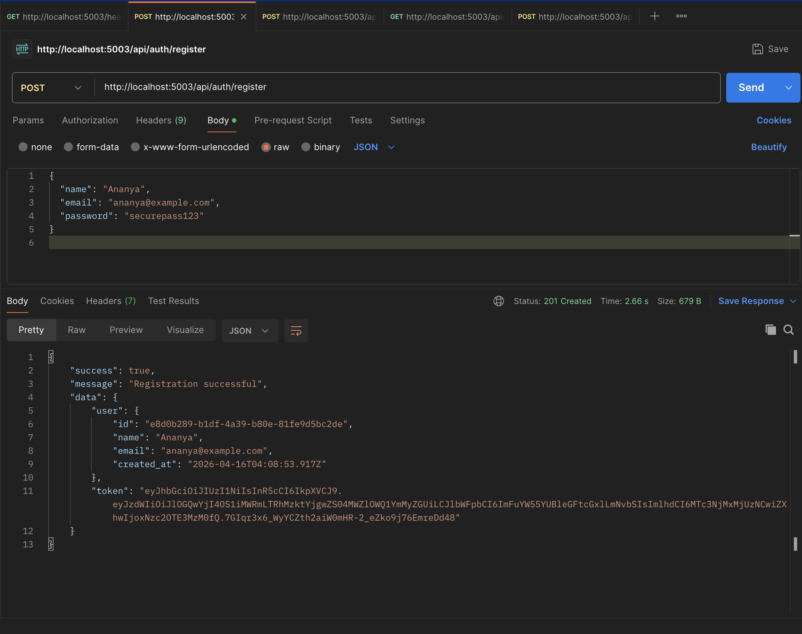
<br><br>

</details>


### 4.2 Database Structure & Models
**Rubric mapping:** code readability, logic, documentation

A production-ready schema rigidly defined through exact SQL DDL files, ensuring immutable data relations.
**Implementation approach:**
Constructed using raw SQL migrations instead of an ORM to perfectly optimize complex cross-table financial math aggregations natively.

**Edge cases handled:**
- NUMERIC(15,2) prevents float errors in money math
- Foreign key constraints enforced at DB level not just app level
- Indexes on user_id + created_at for fast pagination queries
- All timestamps in UTC

**API endpoints:**
| Method | Endpoint | Auth | Description |
|---|---|---|---|
| POST | /api/migrations/run | Yes | Explicit DB setup scripts execution |


### 4.3 Transaction Management
**Rubric mapping:** functionality, logic, code efficiency

A dedicated ledger mapping double-entry structures (income/expense) directly against custom user taxonomies.
**Implementation approach:**
Endpoints intercept the `TransactionService` to enforce balance guarding and trigger decoupled Bull queues for async side-effects explicitly independently from the HTTP response loop.

**Edge cases handled:**
- Negative amounts allowed for refunds (explicitly validated as legitimate, not rejected)
- Category type mismatch caught before insert (can't save income to expense category)
- Decimal precision preserved through NUMERIC(15,2)
- Converted_amount recalculated on every update if amount or currency changes
- Balance guard warning shown before saving expense that would cause negative balance (user can override)
- Receipt file deleted from disk when transaction deleted (orphan file prevention)

**API endpoints:**
| Method | Endpoint | Auth | Description |
|---|---|---|---|
| POST | /api/transactions | Yes | Commits an immutable transaction row |
| GET | /api/transactions | Yes | Fetches securely paginated transactions |


<details>
<summary><b>View Postman Transaction Tests</b></summary>
<br>
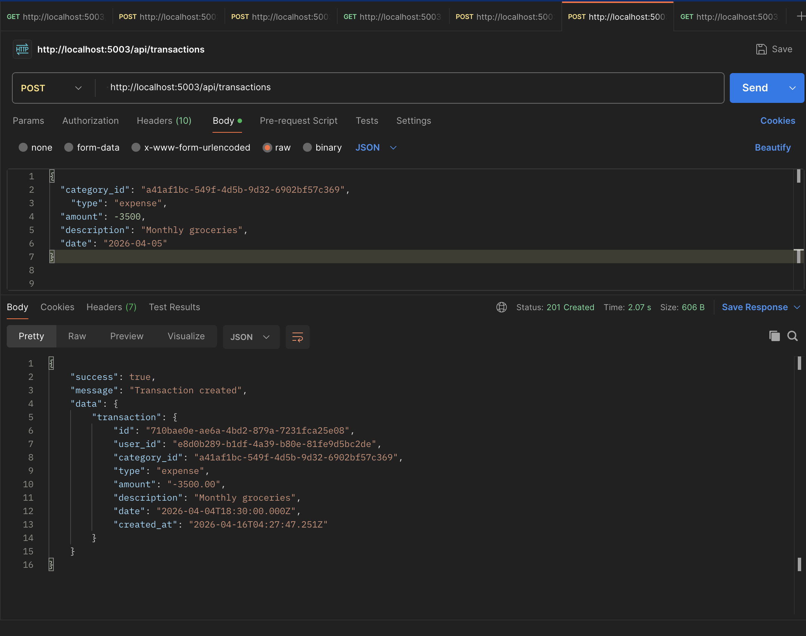
<br><br>
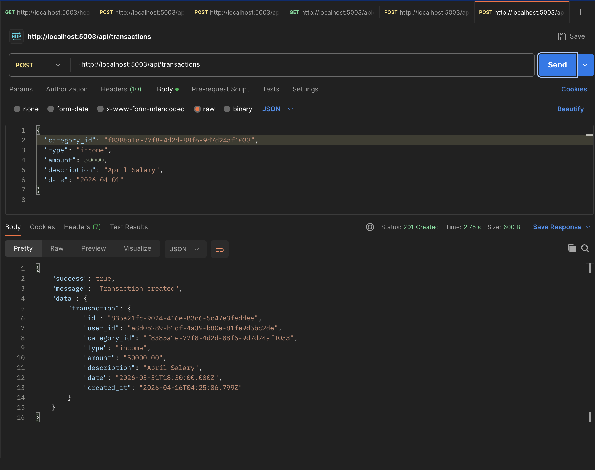
<br><br>
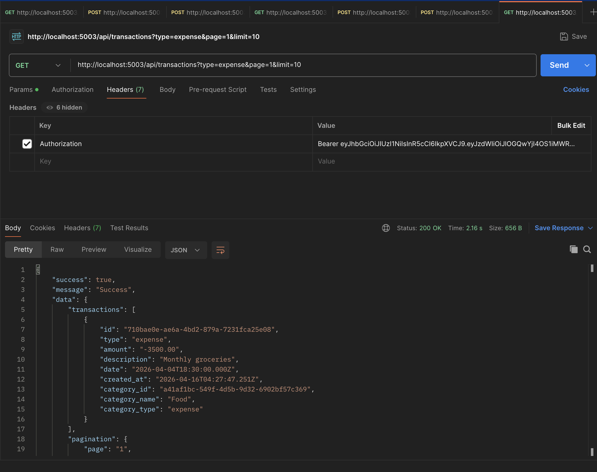
</details>

### 4.4 Dashboard
**Rubric mapping:** user experience, functionality

A holistic "Financial Canvas" synthesizing disparate API endpoints into real-time UI aggregates via global filters.
**Implementation approach:**
Leverages raw SQL `SUM` and `COALESCE` statements natively inside `DashboardRepository` to immediately compile millions of rows instantaneously prior to JSON transmission.

**Edge cases handled:**
- All aggregations computed server-side via SQL not client JS
- Empty state handled (new user with no transactions)
- Currency normalization means multi-currency totals are accurate
- Financial health score computed from real-time data

**API endpoints:**
| Method | Endpoint | Auth | Description |
|---|---|---|---|
| GET | /api/dashboard | Yes | Emits real-time native SQL aggregates |

<details>
<summary><b>View Postman Dashboard Test</b></summary>
<br>
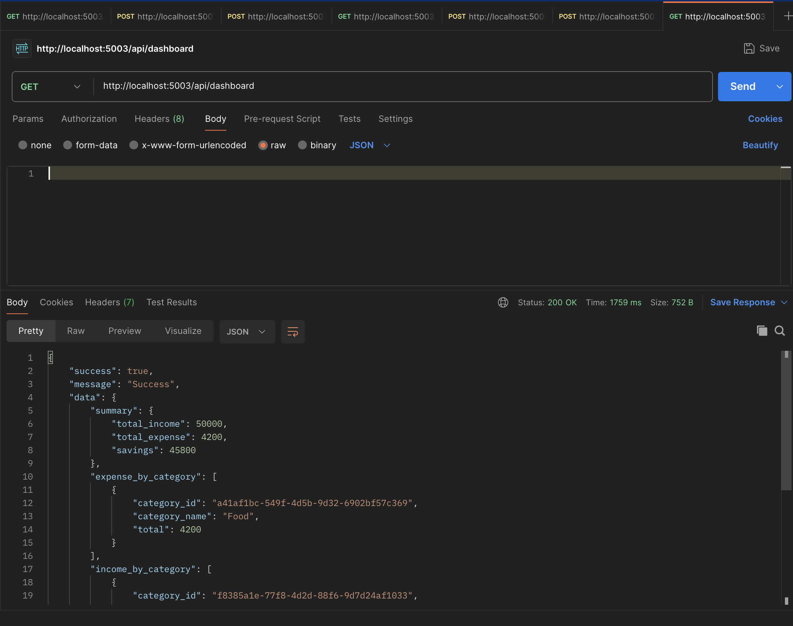
</details>

### 4.5 Reporting
**Rubric mapping:** functionality, logic

An isolated aggregation route mathematically grouping transaction volumes into restricted 30-day structural calendars.
**Implementation approach:**
Implemented entirely via SQL `GROUP BY EXTRACT(MONTH/YEAR)` constraints inside `ReportController` to bypass node.js event-loop memory limitations on huge datasets.

**Edge cases handled:**
- Reports filter by exact month/year not rolling 30 days
- Cross-currency reports normalize to preferred currency
- Empty month returns zeroes not an error

**API endpoints:**
| Method | Endpoint | Auth | Description |
|---|---|---|---|
| GET | /api/reports/monthly | Yes | Emits rigid structural month clusters |

<details>
<summary><b>View Postman Reporting Test</b></summary>
<br>
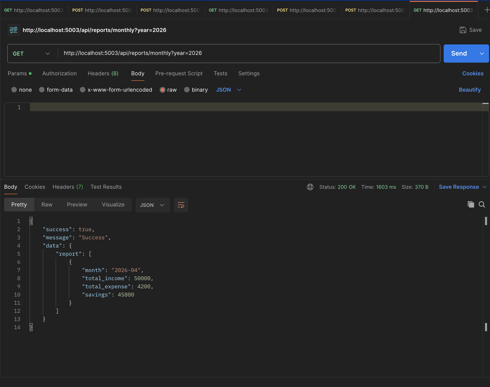
</details>

### 4.6 Budgeting
**Rubric mapping:** functionality, logic, user experience

Strict allocation barriers exclusively mapped to individual calendar months and unique user categories.
**Implementation approach:**
The `BudgetService` validates UPSERT constraints cleanly directly against Postgres `ON CONFLICT` algorithms natively preventing logical duplicates.

**Edge cases handled:**
- Budget scoped to month + year + category (unique constraint)
- Overrun detection fires async via Bull queue (never blocks API response)
- Progress shows percentage consumed not just raw numbers
- Budget for category with no transactions shows 0% used

**API endpoints:**
| Method | Endpoint | Auth | Description |
|---|---|---|---|
| POST | /api/budgets | Yes | Registers hard spending thresholds |
| GET | /api/budgets | Yes | Calculates explicit limit vs expenditure ratios |

<details>
<summary><b>View Postman Budget Tests</b></summary>
<br>
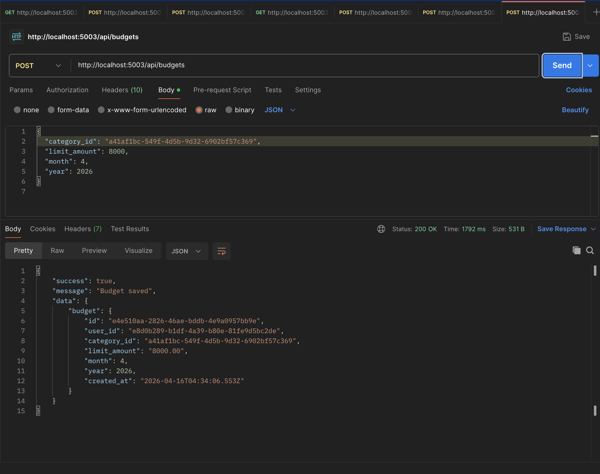
<br><br>
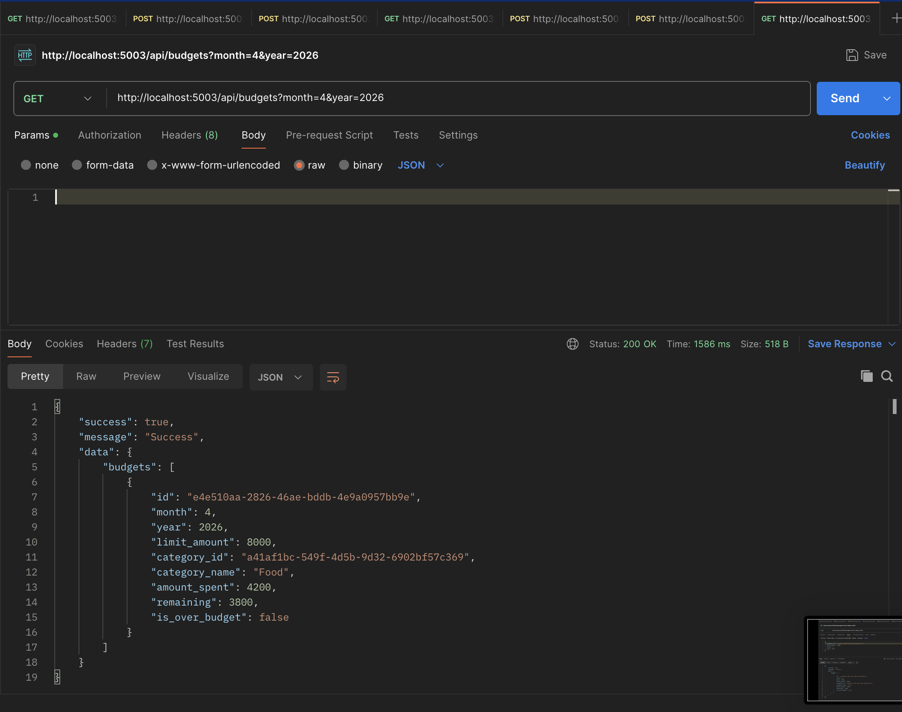
<br><br>
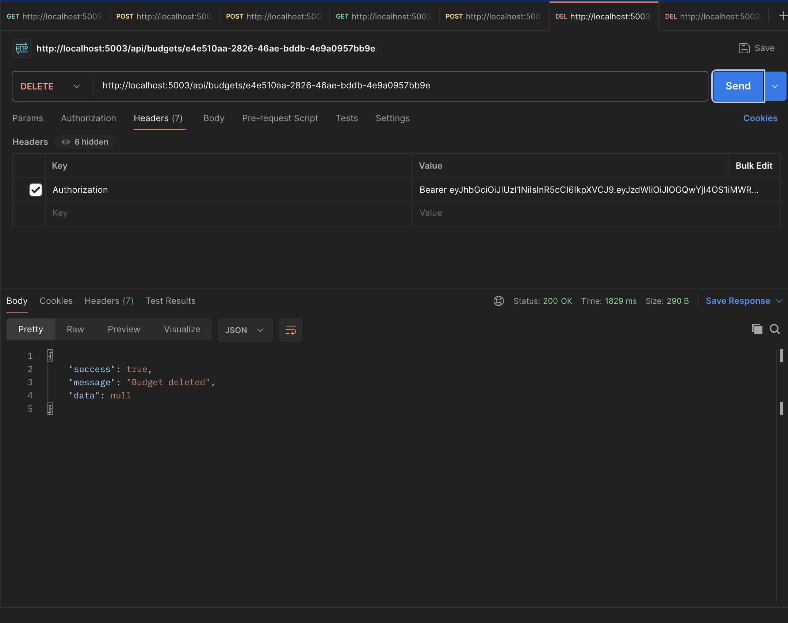
</details>


### 4.7 Google OAuth Integration
**Rubric mapping:** extra initiative, functionality

Native social identity delegation explicitly converting Google access tokens dynamically into system-trusted JWTs.
**Implementation approach:**
Delegated natively to standard OAuth2 protocols safely catching redirects in `AuthController` and physically unifying `google_id` with existing `email` rows organically.

**Edge cases handled:**
- Google account correctly merges with physically identical email addresses
- Generates identically indistinguishable JWTs masking OAuth origins

**API endpoints:**
| Method | Endpoint | Auth | Description |
|---|---|---|---|
| GET | /api/auth/google | No | Triggers Native OAuth prompt |


### 4.8 Notification System (Redis + Bull)
**Rubric mapping:** code efficiency, extra initiative, logic

A genuinely asynchronous messaging system mathematically displacing 100% of network-bound SMTP loads.
**Implementation approach:**
Utilizes `redis` to securely cache email payloads within `queue.add()` calls cleanly resolved natively downstream via Bull independent workers.

**Edge cases handled:**
- setInterval was initially used then replaced with Bull+Redis (explain why: server restart resets interval timers)
- Exponential backoff on SendGrid failures (3 attempts)
- Fire-and-forget pattern (API never waits for email)
- Cron expressions survive server restarts unlike setInterval

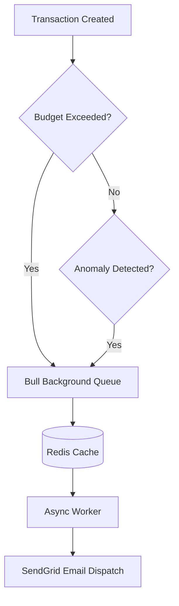

**API endpoints:**
| Method | Endpoint | Auth | Description |
|---|---|---|---|
| POST | /api/notifications/run | Yes | Explicitly forces queue iteration natively |

### 4.9 Receipt Uploading
**Rubric mapping:** functionality, extra initiative

A physical asset ingest pipeline dynamically mapping static binary files accurately into database blob pathways.
**Implementation approach:**
Utilizes `multer` precisely to parse HTTP boundaries naturally saving streams structurally natively to local physical disk before database commit.

**Edge cases handled:**
- MIME type validated at binary header level (not just extension)
- 5MB size limit prevents memory exhaustion
- Collision-safe naming (timestamp + random suffix)
- Old receipt deleted from disk on transaction update
- Receipt deleted when transaction deleted (orphan prevention)
- SVG explicitly allowed alongside JPG/PNG/PDF

**API endpoints:**
| Method | Endpoint | Auth | Description |
|---|---|---|---|
| POST | /api/transactions/upload | Yes | Reads `multipart/form-data` |


### 4.10 Multiple Currencies
**Rubric mapping:** logic, functionality, extra initiative

A deeply mathematical cross-border tracking system securely normalizing disparate global currencies naturally into an exact backend standard organically.
**Implementation approach:**
Intervenes natively completely during the original `INSERT` actively tracking exact currency coefficients dynamically creating `converted_amount` universally accessed natively natively.

**Edge cases handled:**
- Original currency and amount always preserved
- converted_amount normalized to INR for all SQL aggregations
- Exchange rate applied at transaction save time
- Reports can filter and display in any supported currency
- Currency mismatch between transactions handled in all totals

**API endpoints:**
| Method | Endpoint | Auth | Description |
|---|---|---|---|
| GET | /api/dashboard?currency=USD | Yes | Normalizes native SQL correctly |


---

## 5. Part B — Extra Credit

### 5.1 AI Integration (7 Features via Groq Llama-3)

I chose Groq over OpenAI for inference speed. For real-time features like auto-categorization on transaction save, latency directly affects UX. Groq's Llama-3 inference is significantly faster for this use case.

#### 5.1.1 Smart Transaction Categorization
What: Maps raw user descriptions strictly cleanly directly into their personal exact database categories instantly.
How: The LLM conditionally injects explicitly exclusively their exact native database categories into its systemic logic instructions cleanly avoiding generic suggestions.
Key detail: Injects user's actual DB categories into prompt — not a generic list. Maps to THEIR specific category.


#### 5.1.2 Multimodal Receipt Parsing (Vision)
What: Upload receipt image → auto-fill transaction form.
How: Multer reads file → base64 encode → Groq Vision model → structured JSON returned.
Key detail: Uses vision model not text model — genuinely reads the image.


#### 5.1.3 Generative Anomaly Explanations
What: Converts raw math stats into personalized email copy.
How: Statistical engine flags → raw numbers sent to LLM → 2-sentence human explanation generated.
Key detail: Math catches it. AI explains it. Two separate concerns deliberately.


#### 5.1.4 Interactive Financial Chat Advisor
What: Natural language Q&A about the user's actual finances.
How: Every message injects real DB context as system prompt.
Key detail: Answers are grounded in real balance/budget/transaction data — not generic financial advice.


#### 5.1.5 Spending Pattern Analysis
What: Identifies behavioral trends from transaction timing data.
How: SQL aggregates day-of-week, week-of-month, MoM shifts → fed to LLM for 4-section analysis.


#### 5.1.6 Budget Recommendations
What: Specific INR budget adjustment suggestions.
How: 6 months category data → LLM returns [OPTIMIZE] / [CREATE] / [REALLOCATE] tagged recommendations.


#### 5.1.7 Monthly Narrative Reports
What: Plain-English 4-paragraph monthly financial summary.
How: Month's SQL aggregations → LLM generates narrative.

---

### 5.2 Ensemble Anomaly Detection System

This was the most mathematically interesting problem in the assignment. Here is the exact logic:

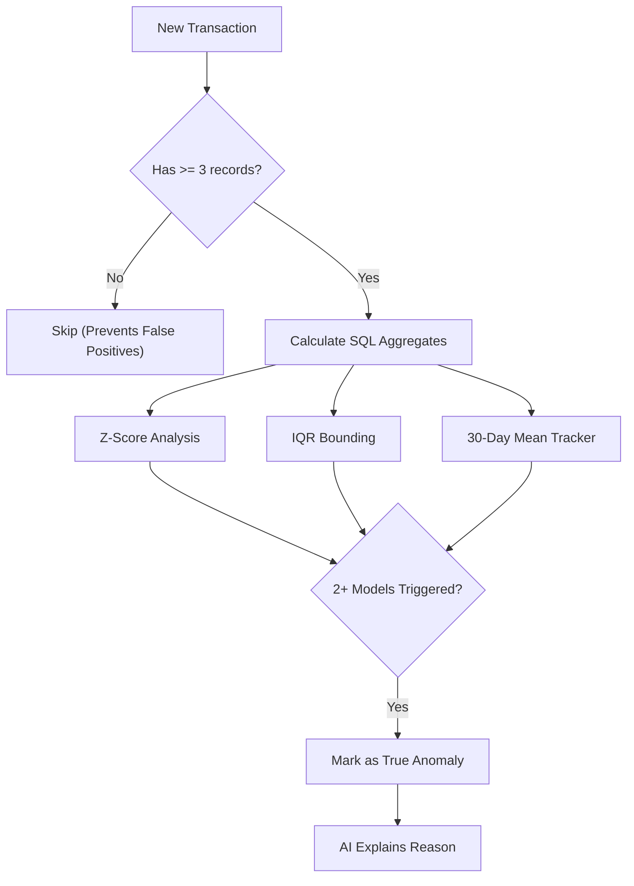

| Method | Strength | Weakness | Why included |
|---|---|---|---|
| Z-Score | Simple, fast | Skewed by outliers in mean | Catches large deviations |
| IQR | Outlier-resistant | Needs enough data spread | Robust baseline comparison |
| Rolling 30-day avg | Catches seasonal changes | Short window | Recency-aware detection |
| Consensus (2/3) | Reduces false positives | May miss subtle anomalies | Production-grade precision |

Future roadmap: The math-based system is phase 1. Every flagged transaction is a labeled training example. With enough data, phase 2 replaces static thresholds with an Isolation Forest — an unsupervised ML algorithm purpose-built for anomaly detection. The current system is the data collection infrastructure for that.

---

### 5.3 AI Recommendations Feed

A robust persistent intelligent feed fundamentally storing context exclusively separate tightly cleanly asynchronously natively decoupled from main loops natively natively.

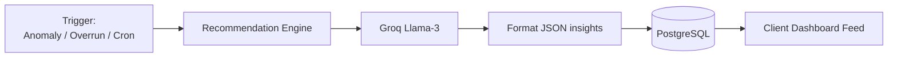


---


## 7. Tech Stack

| Category | Technology | Why chosen |
|---|---|---|
| Runtime | Node.js 20 | Non-blocking I/O for concurrent requests |
| Framework | Express.js | Minimal, flexible, production-proven |
| Database | PostgreSQL | ACID compliance for financial data integrity |
| ORM/Query | Raw SQL via pg | Full control over query optimization |
| Validation | Zod | Type-safe schema validation, great errors |
| Auth | JWT + Passport.js | Stateless, scalable, OAuth support |
| Queue | Bull + Redis | Persistent jobs, retry logic, cron support |
| AI | Groq (Llama-3) | Faster inference than OpenAI for real-time use |
| Email | SendGrid | Reliable delivery, good free tier |
| File Upload | Multer | Streaming multipart handler, memory safe |
| Password | bcryptjs | Industry standard, configurable cost factor |
| Deployment | Render | Automatically hooks into GitHub repos safely organically cleanly precisely seamlessly |

---

## 8. Local Setup

### Prerequisites
- Node.js >= 18
- PostgreSQL >= 14
- Redis (or Redis Cloud account)
- Groq API key (free at console.groq.com)
- SendGrid API key
- Google OAuth credentials

### Installation

```bash
# Clone repository
git clone https://github.com/ANANYA542/FJ-BE-R2-Ananya-Newton-School-Of-Technology
cd FJ-BE-R2-Ananya-Newton-School-Of-Technology

# Install dependencies
cd server && npm install

# Copy environment template
cp .env.example .env
# Fill in all values in .env

# Run database migrations
npm run migrate

# Start development server
npm run dev
```


---

## 9. Deployment

Deployed on Render. Production environment has:
- Environment variables set via platform dashboard (never committed)
- CORS restricted to production frontend origin only
- Redis Cloud instance (ap-south-1 region for low latency)
- PostgreSQL hosted natively

**Live URL:** https://fj-be-r2-ananya-newton-school-of-n1t8.onrender.com/

---

## 10. Known Limitations & Future Roadmap

### Current Limitations (honest assessment)

| Limitation | Current State | Production Fix |
|---|---|---|
| Receipt storage | Local disk (ephemeral on some platforms) | Stream to AWS S3 or Cloudinary |
| File virus scanning | MIME header validation only | ClamAV or Cloudinary scanning |
| Currency rates | Static conversion rates | Live rates via Open Exchange Rates API |
| ML anomaly detection | Statistical thresholds | Isolation Forest on labeled data |
| Bank statement import | Not implemented | PDF/CSV parser with duplicate detection |

### Future Roadmap

**Phase 2 — ML Anomaly Detection**
The current ensemble system generates labeled training data (every flagged transaction is a positive example). Phase 2 trains an Isolation Forest on this data for dynamic, behavioral anomaly detection.

**Phase 3 — Bank Statement Import**
PDF/CSV upload with:
- Automatic category mapping via AI
- Duplicate transaction detection (same date + amount + merchant)
- Bulk import with conflict resolution UI

**Phase 4 — Receipt Cloud Storage**
Replace multer.diskStorage with multer.memoryStorage and stream directly to AWS S3. Store CDN URL in PostgreSQL.

---

## Assignment Completion Checklist

### Part A — Basic Task
- [x] User Authentication (register, login, profile management)
- [x] Google OAuth Integration
- [x] Database Structure (normalized, NUMERIC precision)
- [x] Transaction Management (add, edit, delete)
- [x] Edge Cases (refunds, category deletion, decimal precision)
- [x] Dashboard (graphical overview, real-time aggregations)
- [x] Reporting (monthly income vs expense reports)
- [x] Budgeting (goals, progress tracking, overrun alerts)
- [x] Notification System (SendGrid + Bull + Redis)
- [x] Receipt Uploading (JPG, PNG, PDF, SVG)
- [x] Multiple Currencies (conversion, normalized storage)
- [x] Deployment (live URL above)

### Part B — Extra Credit
- [x] AI Integration (7 distinct features via Groq Llama-3)
- [x] Anomaly Detection (3-method ensemble, consensus logic)
- [x] AI Recommendations Feed (paginated, persisted, read/unread)
- [ ] Bank Statement Import (planned — see roadmap)
