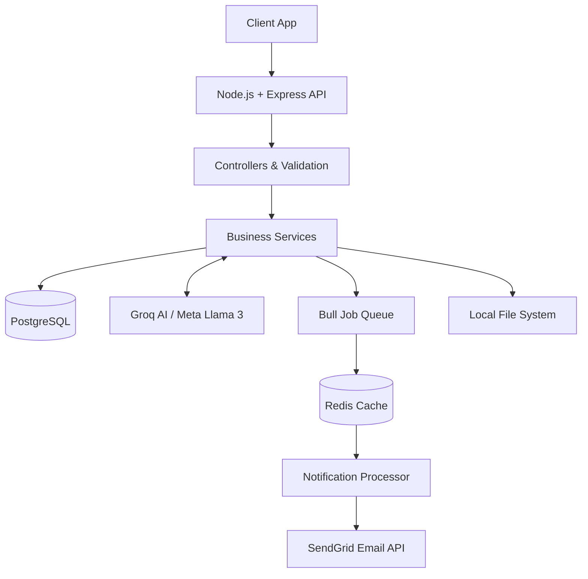

# Personal Finance Tracker — Backend Architecture

A production-ready, intelligent backend for personal finance tracking. Built with **Node.js**, **Express.js**, **PostgreSQL**, **Redis**, **Bull**, and driven by multimodal **AI** (via Groq/Meta-Llama).

> **Note on Endpoints:** The detailed API specifications and raw endpoints have been omitted for brevity. **Screenshots of all API endpoints and testing are available in the repository.**

---

## 🏗 System Architecture

---

## 🤖 AI Integration & Features

This application utilizes modern AI models (specifically Groq APIs running Meta Llama models) to automate and intelligently analyze financial data.

- **Smart Categorization**: When users submit a transaction without a category, the AI parses the description and amount, automatically assigning the most logical financial category.
- **Multimodal Receipt Parsing**: Users can upload receipts (JPG, PNG, PDF, SVG). The Vision model extracts line-items and amounts organically to verify transaction integrity.
- **AI Chat Advisor**: A built-in advisor allowing the user to converse dynamically in natural language about their finances, spending habits, and budgets.
- **Spending Pattern Analysis**: Evaluates high-fidelity time datasets (Day of Week, Week of Month, Month-over-Month metrics) to alert users to behavioral shifts and peak spending vulnerabilities.
- **Budget Recommendations**: Automatically targets historical 6-month budget adherence data to autonomously propose explicit `[OPTIMIZE]`, `[CREATE]`, and `[REALLOCATE]` limit adjustments.
- **Monthly Narrative Reports**: Synthesizes a month's absolute net transaction behaviors into cohesive, human-readable narrative appraisals.
- **Generative Anomaly Insights**: When mathematical anomalies trigger, the LLM generates a personalized, non-alarming conversational insight explaining exactly why the expense looks unusual compared to the user's past data.

---

## 📈 Ensemble Anomaly Detection System (Mathematical Detail)

The anomaly detector uses a robust **Ensemble Statistical approach**. It tracks transactions and calculates historical user benchmarks entirely via SQL aggregations.

### How it operates mathematically NOW:
1. **Prerequisite**: A specific category must contain **>= 3 historical transactions** for the user. Nothing is checked before a baseline forms.
2. **The Ensemble Engine**: The incoming transaction is individually scored against 3 distinct methods:
   - **Z-Score Check**: Evaluates if the amount exceeds `Mean + (2.5 × Standard Deviation)`.
   - **Interquartile Range (IQR) Check**: Evaluates if the amount exceeds the upper-bound `Q3 + (1.5 × IQR)`.
   - **Rolling Average Check**: Evaluates if the amount is strictly greater than `3 × the 30-day rolling category average`.
3. **Consensus Resolution**: To drastically reduce false positives, the transaction is **only flagged** if it triggers `>= 2 of the 3` statistical checks.
4. **Standalone Duplicate Check**: Identical transaction amounts in the exact same category occurring within `48 hours` are flagged independently as duplicate anomalies.

### 🔮 Future Prospects (Machine Learning)
In the future, we plan to transition away from static mathematical thresholds and deploy trained **Machine Learning Models** (e.g., neural networks or isolation forests) to dynamically predict, train on, and intercept financial anomalies based on continuous behavioral modeling.

---

## 🔔 Background Notifications (Redis + Bull)

Handling alerts synchronously bottlenecks the API. We've implemented a full asynchronous job queue for handling notifications and background processing.

- **Infrastructure**: Uses **Redis** coupled with the **Bull** queue library.
- **Job Types**:
  - `anomaly-alert`: Immediately processes mathematical anomalies and dispatches intelligent email warnings.
  - `budget-overrun`: Instantly traps user expenses crossing budget limits and queues warning emails.
  - **Repeatable Cron Jobs**: Managed safely via Bull for generating and dispatching daily summaries, weekly insight digests, and new-month budget allocations.
- **Resilience**: The queue supports automatic exponential backoff on SendGrid API failures without ever blocking user API requests.

---

## 💾 Core Tech Stack

- **Runtime & Framework**: Node.js, Express.js
- **Database**: PostgreSQL
- **Queueing**: Redis + Bull
- **AI Models**: Groq (Llama-3 Text & Vision APIs)
- **Security**: JWT Authentication, Zod Validation, bcrypjs
- **Media Handling**: Multer (Static file serving for JPG, PNG, PDF, SVG)
- **Mailing**: SendGrid `@sendgrid/mail`
